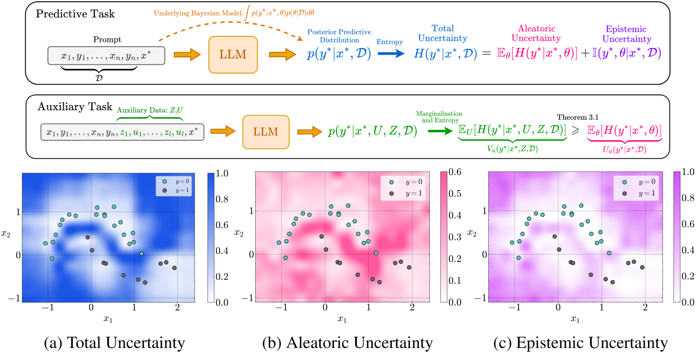
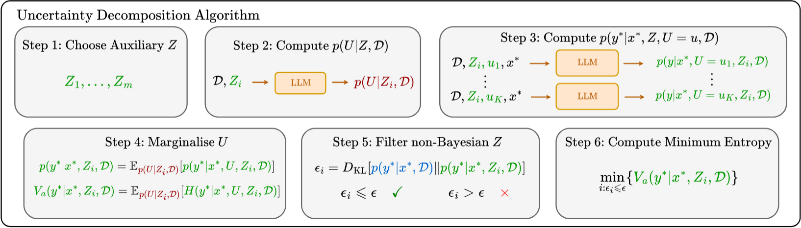

# Variational Uncertainty Decomposition for In-Context Learning
> by [I. Shavindra Jayasekera](http://yingzhenli.net/home/en/?page_id=1411)\* [Jacob Si](https://jacobyhsi.github.io/)\*, [Filippo Valdettaro](https://faisallab.org/members/filippo-valdettaro), [Wenlong Chen](https://chenw20.github.io/wenlongchen.github.io//), [Aldo Faisal](https://faisallab.org/members/aldo-faisal), and [Yingzhen Li](http://yingzhenli.net/home/en/).

<div align="center">
  
  <p><em>Figure 1: Uncertainty Decomposition with Auxiliary Data (Above). Decomposition Example for Two-Moons Dataset (Below).</em>
</div>

<div align="center">
  
  <p><em>Figure 2: Variational Uncertainty Decomposition (VUD) Framework.</em>
</div>

## Installation

The following delineates the installation instructions. Clone this repository and navigate to it in your terminal. Create an environment using a preferred package manager.

Note: can replace `micromamba` with `conda`. Alternatively can use `venv`.

```
micromamba create -n vud python=3.10

micromamba activate vud

pip install -r requirements.txt
```

Update Environment

```
pip freeze > requirements.txt
```

## Serving the LLM
To run an experiment, first, serve the language model in a terminal. Then in a different terminal, run the experiment.

```
vllm serve "Qwen/Qwen2.5-14B" --dtype auto --tensor-parallel-size 1 --max_model_len 8000 --gpu-memory-utilization 0.95
```

## Experiments

### Toy Datasets

Scripts:

```
python run_toy_classification.py

python run_toy_regression.py

python run_toy_classification.py
```

Parameters:

- `dataset_name`: The name of the dataset to use. Options: `logistic_regression`, `moons_1`, `moons_2`, `spirals`, `linear_regression` `gaps`. Default is `logistic_regression`.

- `model_name`: The name of the model to use for predictions. Options: `Qwen/Qwen2.5-14B`, `Qwen/Qwen2.5-14B` and `meta-llama/Meta-Llama-3-8B`. `Qwen/Qwen2.5-14B` is the default.
- `model_port`: The port number for the model server. Default is `8000`.
- `model_ip`: The IP address of the model server. Default is `localhost`.

- `numpy_seed`: The seed for NumPy random number generation. Default is `0`.
- `data_split_seed`: The seed for splitting the dataset. Default is `0`.
- `icl_sample_seed`: If `use_api_call_seed` is `1`, this seed is used for sampling the in-context examples. Default is `0`.
- `fixed_permutation_seed`: If `permute_context` is `0`, this seed is used for permuting the context. Default is `0`.
- `use_api_call_seed`: If `1`, same seed is given to llm when sampling the in-context examples. Default is `0`.

- `shots`: The number of in-context examples to use. Default is `3`.
- `x_row_method`: The method to use for generating the x row. Options: `x_range`, `x_features`, `sample`. Default is `x_range`.
    - `x_range`: Generates x values based on the range of the features.
    - `x_features`: Specify a set of x values. Default is `None`.
    - `sample`: Samples x values randomly from the dataset that are not in the context.
- `num_x_samples`: If `x_row_method` is `sample`, this is the number of x values to sample. Default is `1`.
- `x_sample_seed`: The seed for sampling the x values. Default is `0`.
- `x_features`: If `x_row_method` is `x_features`, this is the set of x values to use. Provide as a string of a dictionary. e.g. for x values (0.5, 0.3), and (0.3, 0.4) the input would be `"{'feature1': [0.5, 0.6], 'feature2': [0.3, 0.4]}"`. Default is `None`.
- `x_range`: If `x_row_method` is `x_range`, this is the grid of x values to use. Provide as a string of a dictionary. e.g. for a grid of x values where `feature1` is the range [0.5, 0.6) with step 0.1 and `feature2` is the range [0.3, 0.4) with step 0.1, the input would be `"{'feature1': [0.5, 0.6, 0.1], 'feature2': [0.3, 0.4, 0.1]}"`. Default is `None`.

- `num_permutations`: The number of ICL permutations to average over. Default is `5`.
- `num_modified_z`: The number of auxiliary z values to use. Default is `3`.
- `num_random_z`: The number of random z values to use. Default is `3`.
- `perturb_about_x`: If `1`, the random z values are generated by perturbing the x values. Default is `1`.
- `perturbation_std`: The scale of the perturbation. Default is `1.0`.
- `num_candidates`: The number of candidates to generate for each BO step. Default is `3`.
- `permute_context`: If `1`, the context is permuted when sampling. Default is `1`.
- `num_outlier_pairs_to_remove`: (For regression only) Number of outlier pairs to removed to form trimmed mean

- `decimal_places`: The number of decimal places to round the z values to. Default is `1`.
- `run_name`: The name of the run. Default is `test`.
- `save_directory`: The directory to save the results. Default is `other`.

- `verbose_output`: If `1`, verbose output is printed. Default is `0`.

### Bandits

Scripts:

```
python run_bandit_classification.py
```

Parameters:

- `model_name`: The name of the model to use for predictions. Options: `Qwen/Qwen2.5-14B`, `Qwen/Qwen2.5-14B` and `meta-llama/Meta-Llama-3-8B`. `Qwen/Qwen2.5-14B` is the default.
- `model_port`: The port number for the model server. Default is `8000`.
- `model_ip`: The IP address of the model server. Default is `localhost`.

- `bandit_name`: Name of the bandit to be used. Default is "buttons".
- `bandit_num_arms`: Number of arms for the bandit. Default is 5.
- `bandit_midpoint`: Midpoint reward probability for the bandit. Default is 0.5.
- `bandit_gap`: Gap between the best and worst arm. Default is 0.2.
- `bandit_seed`: Seed for the bandit reward generation. Default is 0.
- `bandit_exploration_rate`: Exploration rate for the bandit algorithm. Default is 2.

- `num_trials`: Number of trials to run. Default is 10.
- `num_random_trials`: Number of random trials to run. Default is 3.
- `uncertainty_type`: Type of uncertainty to use. Default is "epistemic". Options are "epistemic", "total", and "ucb1".

- `numpy_seed`: The seed for NumPy random number generation. Default is `0`.
- `use_api_call_seed`: If `1`, same seed is given to llm when sampling the in-context examples. Default is `0`.

- `num_permutations`: The number of ICL permutations to average over. Default is `5`.
- `num_modified_z`: The number of auxiliary z values to use. Default is `3`.
- `num_random_z`: The number of random z values to use. Default is `3`.
- `perturbation_std`: The scale of the perturbation. Default is `1.0`.
- `num_candidates`: The number of candidates to generate for each BO step. Default is `3`.

- `decimal_places`: The number of decimal places to round the z values to. Default is `1`.
- `run_name`: The name of the run. Default is `test`.
- `save_directory`: The directory to save the results. Default is `other`.

- `verbose_output`: If `1`, verbose output is printed. Default is `0`.


### OOD Detection

Available built-in question-answering datasets to run:

**BoolQA**: https://arxiv.org/abs/1905.10044

**HotPotQA**: https://arxiv.org/abs/1809.09600

**PubMedQA**: https://aclanthology.org/D19-1259/

Scripts:

```
python run_qa.py --id [NAME_OF_ID_DATASET] --ood [NAME_OF_OOD_DATASET]
```
```
python run_qa.py --id boolqa --ood pubmedqa
```

Parameters:

- `id`: The name of the in-distribution dataset to use. Options: `boolqa`, `hotpotqa`, `pubmedqa`. Default is `boolqa`.
- `ood`: The name of the out-of-distribution dataset to use. Options: `boolqa`, `hotpotqa`, `pubmedqa`. Default is `pubmedqa`.
- `num_D`: Number of in-context training examples. Default is `15`.
- `num_z`: Number of z perturbations. Default is `20`.
