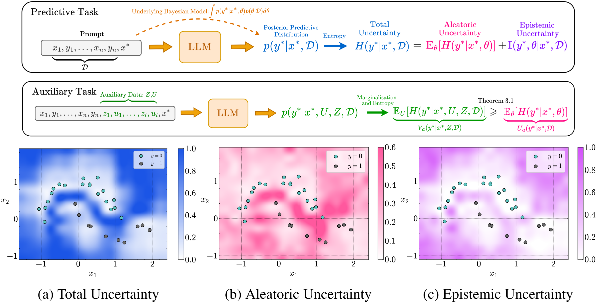
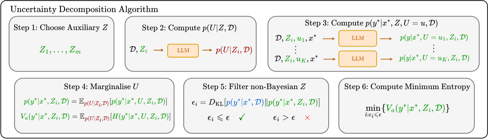

# Variational Uncertainty Decomposition for In-Context Learning
<div align="center">
<div>
    <a href="http://yingzhenli.net/home/en/?page_id=1411" target="_blank">I. Shavindra Jayasekera</a><sup>*</sup> | 
    <a href="https://jacobyhsi.github.io/" target="_blank">Jacob Si</a><sup>*</sup> | 
    <a href="https://faisallab.org/members/filippo-valdettaro" target="_blank">Filippo Valdettaro</a> | 
    <a href="https://chenw20.github.io/wenlongchen.github.io//" target="_blank">Wenlong Chen</a> | 
    <a href="https://faisallab.org/members/aldo-faisal" target="_blank">Aldo Faisal</a> |
    <a href="http://yingzhenli.net/home/en/" target="_blank">Yingzhen Li</a>
</div>
<br>
<div>
    Imperial College London
</div>
<br>
</div>

<p align="center">
<a href="https://arxiv.org/abs/2509.02327"></a>
<a href="https://github.com/jacobyhsi/VUD/blob/main/LICENSE"></a>
</p>

<div align="center">
  
  <p><em>Figure 1: Uncertainty Decomposition with Auxiliary Data (Above). Decomposition for Two-Moons Dataset (Below).</em>
</div>

<div align="center">
  
  <p><em>Figure 2: Variational Uncertainty Decomposition (VUD) Framework.</em>
</div>

## Installation

The following delineates the installation instructions. Clone this repository and navigate to it in your terminal. Create an environment using a preferred package manager.

Note: can replace `conda` with `micromamba` or `uv`.

```
conda create -n vud python=3.10

conda activate vud

pip install vllm
pip install ipykernel
pip install -U ipywidgets
pip install nbconvert
pip install accelerate
pip install pandas matplotlib datasets scikit-learn flask
pip install gpytorch botorch
```

## Serving the LLM
To run an experiment, first, serve the language model in a terminal.

```
bash run_llm.sh
```

Then in a different terminal, run the desired experiments through `run.py`.

## Experiments

### Toy Datasets

Example Scripts:

```
python run.py toy-classification --dataset_name [NAME_OF_DATASET]

python run.py toy-regression --dataset_name [NAME_OF_DATASET]
```

Parameters:

API Parameters
- `model_name`: The name of the model to use for predictions. Options: `Qwen/Qwen2.5-7B`, `Qwen/Qwen2.5-14B` and `meta-llama/Meta-Llama-3-8B`. `Qwen/Qwen2.5-14B` is the default.
- `model_port`: The port number for the model server. Default is `8000`.
- `model_ip`: The IP address of the model server. Default is `localhost`.
- `model_temperature`: The temperature for the model. Default is `1.0`.
- `is_local_client`: Whether to use a local client for the model. Default is `1` (True). `0` for OpenAI API.

Dataset Parameters
- `dataset_name`: The name of the dataset to use. Options: `logistic_regression`, `moons_1`, `moons_2`, `spirals`, `linear_regression` `gaps`. Default is `logistic_regression` for `toy_classification.py` and `linear_regression` for `toy_regression.py`.
- `D_size`: The size of the dataset D. Default is `15`.

X Parameters
- `x_row_method`: The method to use for generating the x row. Options: `x_range`, `x_features`, `sample`. Default is `x_range`.
    - `x_range`: Generates x values based on the range of the features.
    - `x_features`: Specify a set of x values. Default is `None`.
    - `sample`: Samples x values randomly from the dataset that are not in the context.
- `num_x_samples`: If `x_row_method` is `sample`, this is the number of x values to sample. Default is `1`.
- `x_features`: If `x_row_method` is `x_features`, this is the set of x values to use. Provide as a string of a dictionary. e.g. for x values (0.5, 0.3), and (0.3, 0.4) the input would be `"{'feature1': [0.5, 0.6], 'feature2': [0.3, 0.4]}"`. Default is `None`.
- `x_range`: If `x_row_method` is `x_range`, this is the grid of x values to use. Provide as a string of a dictionary. e.g. for a grid of x values where `feature1` is the range $[0.5, 0.6)$ with step 0.1 and `feature2` is the range [0.3, 0.4) with step 0.1, the input would be `"{'feature1': [0.5, 0.6, 0.1], 'feature2': [0.3, 0.4, 0.1]}"`. Default is `None`.
- `x_sample_seed`: The seed for sampling x values. Default is `0`.
- `decimal_places`: The number of decimal places to round the x values to. Default is `1`.

Seed Parameters
- `numpy_seed`: The seed for NumPy random number generation. Default is `0`.
- `data_split_seed`: The seed for splitting the ICL dataset. Default is `0`.
- `icl_sample_seed`: The seed for sampling from the ICL dataset. Default is `0`.
- `fixed_permutation_seed`: If `permute_context` is `0`, this seed is used for permuting the context. Default is `0`.

Permutation Related Parameters
- `num_permutations`: The number of ICL permutations to average over. Default is `5`.
- `permute_context`: If `1`, the context is permuted when sampling. If `0`, the context is not permuted. Default is `1`.

Z Parameters
- `num_z`: The number of auxiliary z values to use. Default is `15`.
- `perturb_about_x`: If `1`, the z values are perturbed about the x values. If `0`, the z values are perturbed about the mean of the ICL data. Default is `1`.
- `perturbation_std`: The amount by which the standard deviation of the Gaussian perturbations (for generating the z values) is scaled. Default is `0.1`.
- `num_bo_z`: The number of z values to use for Bayesian Optimization. The first `num_z` - `num_bo_z` z values are randomly sampled. If `0`, no Bayesian Optimization is performed. Default is `0`.
- `num_candidates`: The number of candidates to generate for Bayesian Optimization. Default is `3`.

Other parameters
- `run_name`: The name of the run. Default is `test`.
- `save_directory`: The sub-directory within `/results/toy_classification` or `/results/toy_regression` (respectively) to save the results in. Default is `other`.
- `verbose_output`: If `1`, verbose output is printed. Default is `0`.
- `va_method`: `vanilla` uses the forward factorization; `parallel_pf` is the
  joint-canvas Monte Carlo estimator scored by the forward conditional;
  `parallel_pp` estimates conditional entropy from joint counts (classification)
  or a fitted bivariate Gaussian (regression), without forward conditional calls; and
  `parallel_hybrid` retains the earlier parallel-`u`/sequential-`y|u` ablation.
  `parallel` remains a legacy alias for `parallel_pf`, including in regression.
- `num_joint_samples`: Number of paired `(u, y)` samples. The toy default is 10;
  specify a larger number for PP and check convergence, particularly for rare u labels.
  Explicit PF/PP names default to separate `va_parallel_pf` / `va_parallel_pp`
  result directories; legacy `parallel` retains its old directory spelling.

Toy classification PP example (1000 is illustrative, not a convergence guarantee):

```bash
CUDA_VISIBLE_DEVICES=3 python run.py toy-classification \
  --model_name "Dream-org/Dream-v0-Base-7B" \
  --dataset_name logistic_regression --va_method parallel_pp --num_joint_samples 1000
```

Gaps regression PP example (100 is exploratory, not a convergence guarantee):

```bash
python run.py toy-regression \
  --model_name "Dream-org/Dream-v0-Base-7B" \
  --dataset_name gaps --x_range "{'x': [-15, 15, 0.2]}" \
  --va_method parallel_pp --num_joint_samples 100 \
  --model_temperature 1 --icl_sample_seed 0 \
  --save_directory Dream-v0-Base-7B/va_parallel_pp_n100 --resume 1
```

Regression PP fits a **joint-Gaussian approximation**, using the sample covariance
(`ddof=1`) of the paired numerical outputs. It derives
`var(y|u) = var(y) - cov(u,y)^2 / var(u)` and computes the analytic conditional
entropy `Va = 0.5 * ln(2*pi*e*var(y|u))` in **nats**, not a mean forward NLL or
the in-sample mean NLL of the fitted Gaussian. `Va_variance` is this conditional
variance. No extra forward conditional prompts or mixture resampling are used.
The baseline remains the existing separately prompted Gaussian. KL filtering
uses baseline || fitted parallel y marginal. The existing plot selects minimum
Va among the five lowest-KL candidates (including rank ties) and caps selected
Va at total uncertainty; saved candidate Va/Ve remain unclipped.

At least 3 joint samples are required. `--pp_covariance_floor` defaults to `1e-6`:
eigenvalues below this absolute output-squared threshold are raised to it, and
**all** fitted joint, marginal, and conditional quantities use the same resulting
covariance. Set it to `0` for no regularization (singular fits then fail).
The floor is scale-dependent and can materially affect near-degenerate fits;
inspect the saved flag and raw covariance. A nonpositive/nonfinite baseline
variance is rejected rather than silently changing vanilla's baseline fit.
Joint fitting uses all accepted pairs; `std_method` and outlier trimming still
apply to the baseline, not to the PP joint.

Each regression PP row saves `joint_samples_json` (ordered `[u,y]` pairs),
sample/context seeds, parse failures, `joint_gaussian_fit_json` (raw and fitted
covariance, means, slope/intercept, conditional variance), and estimator/settings
metadata. Samples are pooled across context permutations when enabled. Invalid
numeric decodes are retried with new seeds, with failures recorded; estimates
therefore describe successfully decoded numeric pairs. Other model errors fail
the run. Larger N does not cure Gaussian misspecification, nonlinear dependence,
or heteroskedasticity. Inspect the saved pairs and check convergence.

Results go under `results/toy_regression/gaps/<save_directory>/seed_0/` unless the
seed suffix is already present. Use separate directories for different PP sample
counts/settings: incompatible existing results are rejected before writing.
The default output path for explicit `parallel_pp` remains `va_parallel_pp/seed_0/`.

### Bandits

Example Scripts:

```
python run.py bandit-classification

python run.py bandit-classification --model_temperature 2.0 --bandit_num_arms 10 --bandit_midpoint 0.6 --bandit_gap 0.1 --bandit_exploration_rate 1.0 --num_trials 100 --num_random_trials 10 --uncertainty_type total --run_name buttons_midpoint_0.6_gap_0.1 --save_directory 10_arm_bandit
```

Parameters:

API Parameters
- `model_name`: The name of the model to use for predictions. Options: `Qwen/Qwen2.5-14B`, `Qwen/Qwen2.5-14B` and `meta-llama/Meta-Llama-3-8B`. `Qwen/Qwen2.5-14B` is the default.
- `model_port`: The port number for the model server. Default is `8000`.
- `model_ip`: The IP address of the model server. Default is `localhost`.
- `model_temperature`: The temperature for the model. Default is `1.0`.
- `is_local_client`: Whether to use a local client for the model. Default is `1` (True). `0` for OpenAI API.

Bandit Parameters
- `bandit_name`: Name of the bandit to be used. Default is "buttons".
- `bandit_num_arms`: Number of arms for the bandit. Default is `5`.
- `bandit_midpoint`: Midpoint reward probability for the bandit. Default is `0.5`.
- `bandit_gap`: Gap between the best and worst arm. Default is `0.2`.
- `bandit_seed`: Seed for the bandit reward generation. Default is `0`.
- `bandit_exploration_rate`: Exploration rate for the bandit algorithm. Default is `2.0`.
- `is contextual_bandit`: `0` if a contextual bandit problem. `1` otherwise. Default is `0`

Experiment Parameters
- `num_trials`: Number of trials to run. Default is `10`.
- `num_random_trials`: Number of random trials to run. Default is `3`.
- `uncertainty_type`: Type of uncertainty to use. Default is "epistemic". Options are "epistemic", "total", and "ucb1".

Seed Parameters
- `numpy_seed`: The seed for NumPy random number generation. Default is `0`.
- `fixed_permutation_seed`: If `permute_context` is `0`, this seed is used for permuting the context. Default is `0`.

Permutation Related Parameters
- `num_permutations`: The number of ICL permutations to average over. Default is `10`.
- `permute_context`: If `1`, the context is permuted when sampling. If `0`, the context is not permuted. Default is `1`.

Z Parameters
- `num_z`: The number of auxiliary z values to use. Default is `1`.
- `perturbation_std`: The amount by which the standard deviation of the Gaussian perturbations (for generating the z values) is scaled. Default is `1.0`.
- `decimal_places`: The number of decimal places to round the x values to. Default is `1`.
- `min_KL_rank`: Chooses the z value with the lowest Va from the z values with smallest `k` KL values. Default `k=1`.

Other parameters
- `run_name`: The name of the run. Default is `test`.
- `save_directory`: The sub-directory within `/results/bandits` to save the results in. Default is `other`.
- `verbose_output`: If `1`, verbose output is printed. Default is `0`.


### OOD Detection

Available built-in question-answering datasets to run:

**BoolQA**: https://arxiv.org/abs/1905.10044

**HotPotQA**: https://arxiv.org/abs/1809.09600

**PubMedQA**: https://aclanthology.org/D19-1259/

Scripts:

```
python run.py qa --id [NAME_OF_ID_DATASET] --ood [NAME_OF_OOD_DATASET]
```
```
python run.py qa --id boolqa --ood pubmedqa
```

Parallel QA (Dream Base or Instruct):

```bash
CUDA_VISIBLE_DEVICES=0 python run.py qa --id boolqa --ood hotpotqa \
  --model "Dream-org/Dream-v0-Instruct-7B" --va_method parallel_pf --num_joint_samples 100
```

Add `--va_method parallel_pf --num_joint_samples 100` to any of the QA commands,
including ID-only `--id mmlu_cs` and `--id mmlu_moral`. Vanilla remains the
default. Dream runs locally; no model server is needed.

For each perturbed auxiliary input z, both PF and PP jointly denoise (u,y) on a
shared two-mask QA canvas, using the full chat template for Instruct. It uses
the toy parallel method's label-constrained, lowest-entropy-first unmasking
schedule; either slot can be filled first (not simultaneous one-step filling).
`parallel_pf` then evaluates the sampled y
with the vanilla forward conditional prompt, with that same z, sampled u,
and context ordering. Va is the mean `-log2 p_F(y|x,u,z,D)` (bits), not the
entropy of the parallel conditional. Ve is TU minus Va and can be negative.

`parallel_pp` uses only the joint pairs for Va, with no forward conditional
scoring calls. For counts `n[u,y]` and `n[u] = sum_y n[u,y]`, it computes:

```text
pP_hat(u,y) = n[u,y] / N
pP_hat(y|u) = n[u,y] / n[u]                     (only when n[u] > 0)
Va_PP = -sum_{n[u,y]>0} (n[u,y]/N) * log2(n[u,y]/n[u])
```

For example, counts `[[54, 6], [10, 30]]` give Va approximately 0.606 bits.
Unobserved u groups are explicitly undefined (`null` in QA conditional JSON),
not assigned invented probabilities, and contribute zero to the empirical sum.
There is no pseudocount smoothing or bias correction. Counts pool over the
context-permutation sampling schedule, so PP estimates the conditional entropy
of that pooled joint, not an average of per-permutation entropies.

```bash
CUDA_VISIBLE_DEVICES=3 python run.py qa --id boolqa --ood hotpotqa \
  --model "Dream-org/Dream-v0-Instruct-7B" --va_method parallel_pp --num_joint_samples 1000
```

Larger N may be necessary for PP's rare auxiliary-label groups; check stability
as N increases. A smaller empirical Va at low N can be finite-sample bias.
PF and PP use the same QA sampling seeds for the same x, z, draw index, and seed.

`--num_joint_samples` (default 100) is the **total number of draws per z**,
cycled across `--num_seeds` context permutations (default 5). TU remains the
entropy of the separately prompted p(y|x,D), averaged over those permutations.
As in vanilla, the runner selects the minimum-Va candidate among the five
lowest-KL z candidates; parallel's KL uses the empirical marginal of sampled y.
The existing 15-example context and 20 z candidates are unchanged.

New results are saved separately under
`results/qa/<model>/va_parallel_pf/n<N>_seed<S>_permutations<K>/` or
`results/qa/<model>/va_parallel_pp/n<N>_seed<S>_permutations<K>/`.
The legacy `--va_method parallel` still means PF and retains the old
`va_parallel_entropic_mc` path so existing queues/checkpoints continue working.
New result rows use canonical `parallel_pf` or `parallel_pp` metadata;
existing files and running processes are not renamed or restarted.
`--resume` resumes completed x rows and checks estimator/configuration metadata;
it does not reuse vanilla results. Sampling seeds are stable across restarts.
The CSV includes the selected z, KL, empirical joint and y marginal, baseline
probabilities, and estimator metadata alongside the existing uncertainty columns.
PP also saves the selected candidate's joint counts, u counts, and empirical
conditional probabilities. PF checkpoints cannot be resumed as PP or vice versa.

Vanilla QA now uses the same perturbed z for both p(u|z,D) and
p(y|x,u,z,D), matching parallel's consistent use of z. Older vanilla QA results
used the original auxiliary example in the conditional and must be rerun for
this correction. Do not resume those older checkpoints into a corrected run;
archive them first if you want to preserve them.

Parameters:

- `id`: The name of the in-distribution dataset to use. Options: `boolqa`, `hotpotqa`, `pubmedqa`. Default is `boolqa`.
- `ood`: The name of the out-of-distribution dataset to use. Options: `boolqa`, `hotpotqa`, `pubmedqa`. Default is `pubmedqa`.
- `num_D`: Number of in-context training examples. Default is `15`.
- `num_z`: Number of z perturbations. Default is `20`.

Evaluation:

Before evaluating out-of-distribution results, ensure that the data paths are updated in `eval_ood.py`.

```
python eval_ood.py
```

## Citation

Please consider citing our paper if you find it helpful. Thank you :grinning:!

```
@misc{jayasekera2025variationaluncertaintydecompositionincontext,
      title={Variational Uncertainty Decomposition for In-Context Learning}, 
      author={I. Shavindra Jayasekera and Jacob Si and Filippo Valdettaro and Wenlong Chen and A. Aldo Faisal and Yingzhen Li},
      year={2025},
      eprint={2509.02327},
      archivePrefix={arXiv},
      primaryClass={stat.ML},
      url={https://arxiv.org/abs/2509.02327}, 
}
```
